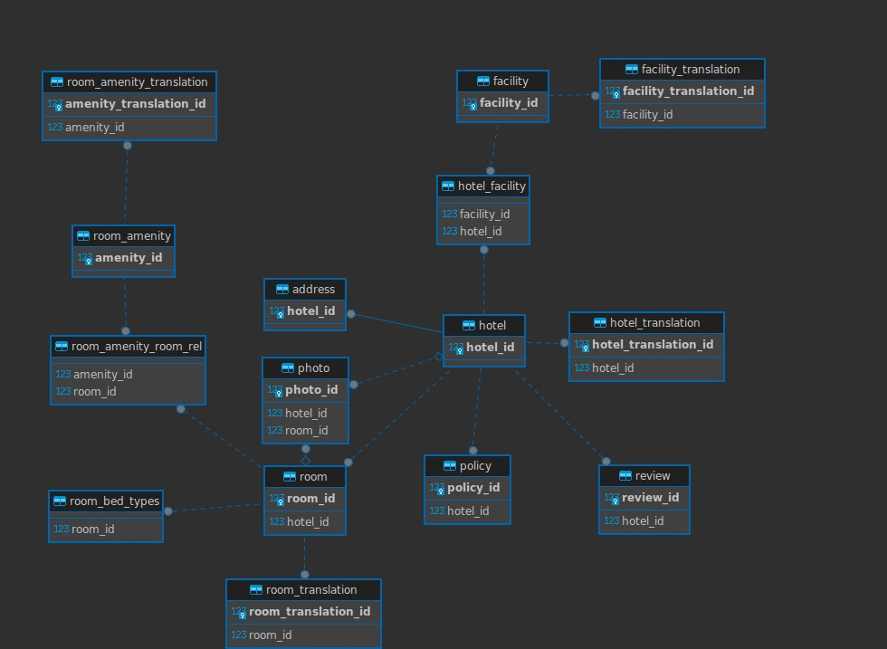

# Cupid Travel

Cupid Travel is a web application for managing hotels, facilities, and room amenities. This project is developed using Spring Boot, PostgreSQL, and Redis. The application provides various services to fetch data from external APIs, store it in a local database, and present it to users.

## Table of Contents

- [Features](#features)
- [Requirements](#requirements)
- [Installation](#installation)
    - [Using Docker](#using-docker)
    - [Manual Installation](#manual-installation) 
- [Usage](#usage)
- [Testing](#testing)
- [Contributing](#contributing)
- [License](#license)

## Features

- Manage hotel information
- Manage facility information
- Manage room amenities
- Fetch data from external APIs
- Scheduled tasks for automatic data updates
- Entity Relation Diagram:



## Requirements

- Java 17
- Maven[
- Docker (optional, for Docker-based setup)

## Installation

### Using Docker

31. Clone the repository:

```sh
git clone https://github.com/enemymerch/cupid-travel.git
cd cupid-travel
```

32. Package the project with Maven:

```sh
mvn clean package
```

33. Start all services using Docker Compose:

```sh
docker-compose up --build
cdocker-compose up --build
```

This command will start PostgreSQL and Redis, and your Spring Boot application.

4. Access the application in your browser:

```sh
http://localhost:8085
```

### Manual Installation
1. Clone the repository:

```sh
git clone https://github.com/enemymerch/cupid-travel.git
cd cupid-travel
```

3. Install the required dependencies:

  - PostgreSQL - Redis
  - Java 17
  - Maven[

4. Start PostgreSQL and Redis and set the appropriate environment variables.

5. Run the project with Maven:

```sh
mvn spring-boot:run
```

6. Access the application in your browser:

```sh
http://localhost:8080
```

## Usage

Scheduled tasks are automatically run by the application to update data. The application also provides various REST API endpoints for managing hotels, facilities, and room amenities. Visit /swagger-ui.html to view the api documentation.

Example of API endpoints:

```table
| Method | URL | Description | 
|----------------------------------------------------------------------------------------------------------------| 
| GET | /api/hotels | List all hotels | 
| GET | /api/hotels/$id | Get a specific hotel | 
| POST | /api/hotels | Add a new hotel | 
| GET | /api/room-amenities | List all room amenities | 
| GET | /api/room-amenities/$id | Get a specific room amenity | 
| POST | /api/room-amenities | Add a new room amenity | 
```

## Testing

Run the tests using the following command:

```sh
mvn test
```
This command will run all unit and integration tests.

## Contributing

To contribute, please follow these steps:
1. Fork the repository (https://github.com/your-username/cupid-travel/fork)
2. Create your feature branch `git checkout -b feature/fooBar`
   w. Commit your changes `git commit -am 'Add some fooBar'`
4. Push to the branch `git push origin feature/fooBar`
5. Create a new Pull Request


## License

This project is licensed under the MIT License. See the "LICENSE" file for more details.
